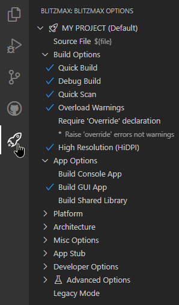
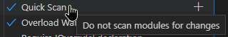
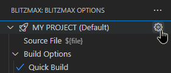

## Changing your BlitzMax build options
---
Your activity bar has a brand new BlitzMax button!\
Click the rocket in your activity bar to see your current BlitzMax build options.

Double click to toggle items on and off.\
Hover your mouse over an item to display more information.

* _The build options view is displaying your default build task in `.vscode/tasks.json`.\
Read more in the "Building & Tasks" step._

## Multiple build options
---
Click the cogwheel to select a new build task or create a new one.

* _This will change your default build task in `.vscode/tasks.json`.\
Read more in the "Building & Tasks" step._

## Legacy build option
---
The legacy build option is unique to VS Code.\
It ensures that no NG specific build options are passed to the BlitzMax legacy compiler.\
This means that the legacy build option should __only__ be enabled if you're using BlitzMax legacy.