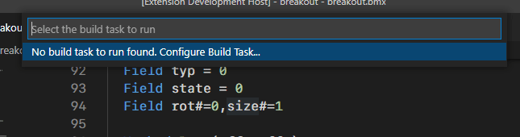
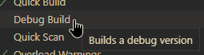

## Quick build
---
A quick way to build your application is by using the shortcut button in the upp right corner.\
This will automatically generate and run a VS Code build task based on your build options.

These buttons are context sensitive.\
That means they will only be visible while editing a BlitzMax source file.

* _Remember that pressing F5 is the same as using the `Run` menu to start debugging (F5), and will not use your build options.\
Read more in the "Debug & Run Without Debug" step._

## Building via tasks
---
Tasks in VS Code are simple JSON scripts located inside `<your project>/.vscode/tasks.json`.\
They can do anything your terminal can, plus a lot more.

You can use the `Terminal` menu to run or create a build task _(Ctrl + Shift + B)_.

If no build task exists, you will be prompted to select a template build task.

This will create a new `tasks.json` or add your selected template.\
The new task JSON script will be displayed and you're ready to edit or run it.

You can hover over the items to get more information about them, and use auto-complete _(Ctrl + Space)_ to display all your options.\
You can also use the build options view to edit the default build task settings.

BlitzMax VS Code tasks use the `bmx` task type.\
You can read more about VS Code tasks [here](https://code.visualstudio.com/docs/editor/tasks)

## How do a I build a debug/release version?
---
Open your build options view or `tasks.json` and set "Debug" to true or false.

Use the build button in the corner.

Or run your build task _(Ctrl + Shift + B)_.

* _Remember that pressing F5 is the same as using the `Run` menu to start debugging (F5), and will not use your build options.\
Read more in the "Debug & Run Without Debug" step._