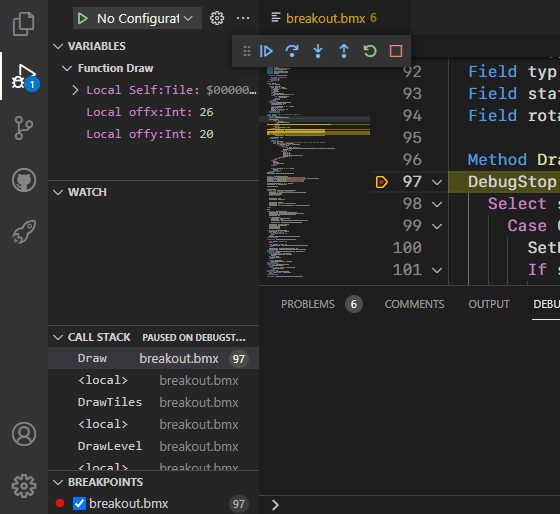

## Debugging

Use the `Run` menu to start debugging _(F5)_ or run without debugging _(Ctrl + F5)_.

"Start Debugging" will always start a debug version of your application.\
While "Run Without Debugging" always runs a release version of your application.

You can also use the `Run and Debug` view.

Here you will have the option to create a custom debug configuration via `launch.json`.\
This is **not** required!\
Your current build options will be used by default when no `launch.json` configuration exists.\
Simply press the "Run and Debug" button to start debugging.

The internal VS Code debugger is used for debugging.

You can read more about the VS Code debugger [here](https://code.visualstudio.com/docs/editor/debugging).