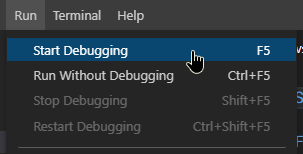
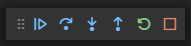
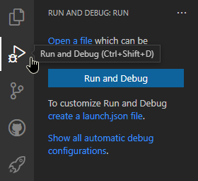
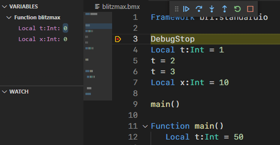

# Debugging and running your application

Use the `Run` menu to start debugging _(F5)_ or run without debugging _(Ctrl + F5)_.

"Start Debugging" will always start a debug version of your application.\
While "Run Without Debugging" always runs a release version of your application.\
Your other build options will still apply.

Debugging or not, once your session starts the Debug toolbar will appear on the top of the editor.\
You can use this to stop your application at any time, even outside of debug mode.\
The other debug buttons will become available once a `DebugStop` is reached in your application.

You can also use the `Run and Debug` view.

Here you will have the option to create a custom debug configuration via `launch.json`.\
This is **not** required!\
Your current build options will be used by default when no `launch.json` configuration exists.\
Simply press the "Run and Debug" button to start debugging.

The internal VS Code debugger is used for debugging.

You can read more about the VS Code debugger [here](https://code.visualstudio.com/docs/editor/debugging).