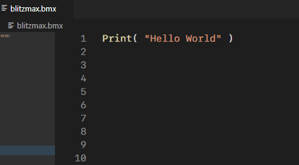
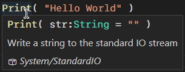
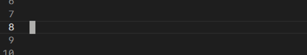
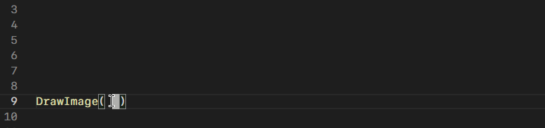

# Accessing the BlitzMax documentation

Right click any known keyword and select "Quick Help" _(F1)_ to display the default BlitzMax documentation.

Hover your mouse over a keyword to display a short description.

Use auto-complete _(Ctrl + Space)_ to see keyword suggestions and snippets.\
Press _Tab_ to insert the current snippet from the auto-complete list.\
Snippets sometimes come with suggestions, keep pressing _Tab_ to jump to the next suggestion.
* _functions with parameters always has snippets._

Use the signature helper _(Shift + Ctrl + Space)_ to display what parameters a function accepts.

All of these options can be automated, or turned on or off in your settings.