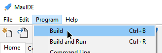
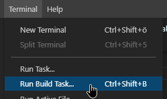
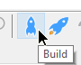
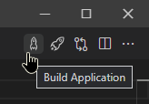
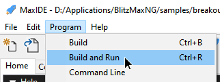
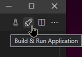
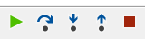
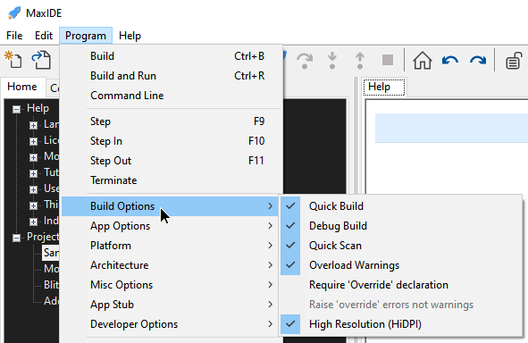
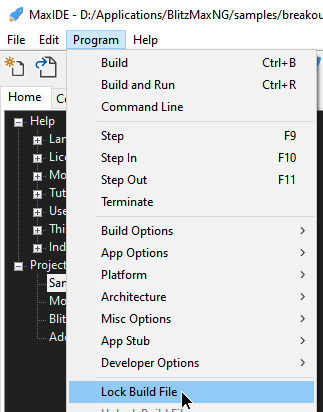

# Why should I switch?

Switching to a new source-code editor is always a scary and tedious task.\
The main benefit of switching to VS Code is that no matter what language or tools you're using, you can almost always be sure that VS Code supports it.

Which means that this could potentially be the last switch you'll ever make.

Remember that the base VS Code features are just the start!\
Add languages, debuggers, and tools to your installation to support your development workflow.\
Read more in the "Tips & Tricks" step.

# MaxIDE / BLide differences

VS Code has to [support hundreds of programming languages](https://code.visualstudio.com/docs/languages/overview), which means it might work a bit differently than you're used to.

Things to remember when coming from MaxIDE / BLIde:
---
* Pressing F5 **always** results in running a debug build
	* _Read more in the "Debug & Run Without Debug" step_
---
* Projects are simply a folder
	* _Read more in the "Folders & Workspaces" step_
---
* Building is done via "tasks", which are small JSON scripts located in `.vscode/tasks.json` and can be automatically handled
	* _Read more in the "Building & Tasks" step_
---
* "Lock Build File" is done per build task and can be done by right clicking any `.bmx` file and selecting "Set As Default Build Task Source File"
	* _Read more in the "Folders & Workspaces" step_
---
* Things like "[Go To Definition](https://code.visualstudio.com/docs/editor/editingevolved#_go-to-definition)", the "[outline view](https://code.visualstudio.com/docs/getstarted/userinterface#_outline-view)" and "[breadcrumbs](https://code.visualstudio.com/docs/editor/editingevolved#_breadcrumbs)" are handled by an external application called a Language Server
	* _Read more in the "Optional Features" step_
---
* All the build options - _and more_ - from MaxIDE and BLide can be found in the build options view
	* _Read more in the "Changing Build Options" step_
---
* When using BlitzMax Legacy/Vanilla you need to enable `Legacy Mode`
	* _Read more in the "Changing Build Options" step_
---
* VS Code is context sensitive, meaning that it changes depending on the source-code language you're currently editing\
BlitzMax features are only available when editing BlitzMax source files

# Direct comparison

## Building
MaxIDE\

VS Code\

MaxIDE\

VS Code\

## Debug & Run
MaxIDE\

VS Code\

MaxIDE\

VS Code\

MaxIDE\

VS Code\

## Build options
MaxIDE\

VS Code\

## Lock build file
MaxIDE\

VS Code\

