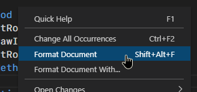

## Code Formatter

A code formatter is an external application that helps keep your layout, indentation and capitalization consistent across all of your projects.\
Right click the `.bmx` document you're editing and select "Format Document".\
You can also select the specific text you want formatted.

VS Code has many optional settings for automatic formatting, including "Format On Type" and "Format On Save".

The code formatter needs to be installed manually and "formatter path" needs be set in your [BlitzMax extension settings](command:blitzmax.settings).\
You can find BlitzMax code formatters [here](https://github.com/search?q=topic%3ABlitzMax+topic%3Aformatter).

## Language Server Protocol (LSP)

A LSP is an external application that provides diagnostics, better auto-complete, code fixes and suggestions among many other things.\
The LSP starts automatically and keeps track of your code in the background as you type.

The LSP needs to be installed manually and "LSP path" needs be set in your [BlitzMax extension settings](command:blitzmax.settings).\
You can find BlitzMax LSPs [here](https://github.com/search?q=topic%3ABlitzMax+topic%3Alsp).