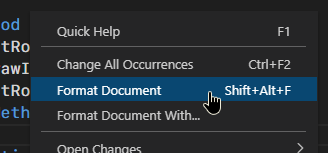

# Code Formatter

A code formatter is an external application that helps keep your layout, indentation and capitalization consistent across all of your projects.\
Right click the BlitzMax document you're editing and select "Format Document".\
You can also select the specific text you want formatted.

VS Code has many optional settings for automatic formatting, including "Format On Type" and "Format On Save".

The language server does not format, so this one is a separate program.\
The extension looks for a formatter called `bfm` in the `bin` folder of your BlitzMax NG install.\
If yours has a different name or lives somewhere else, set the "formatter path" in your [BlitzMax extension settings](command:blitzmax.settings).\
Search for BlitzMax code formatters on [GitHub](https://github.com/search?q=topic%3ABlitzMax+topic%3Aformatter).

# Language Server Protocol (LSP)

A language server is a separate program that provides diagnostics, document symbols _(outliner)_, better auto-complete, code fixes and suggestions among many other things.\
It starts automatically and keeps track of your code changes in the background.

BlitzMax NG 1.00 and newer ships with one, so a recent release is all you need and there is nothing to install or set up.\
It is called `bls` and it sits in the `bin` folder of your BlitzMax NG install, next to `bmk` and `bcc`, which is where the extension looks.\
If you keep it somewhere else, set the "LSP path" in your [BlitzMax extension settings](command:blitzmax.settings).