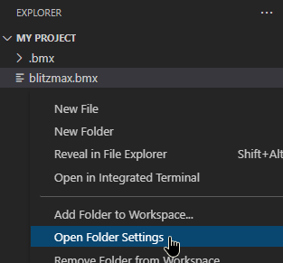
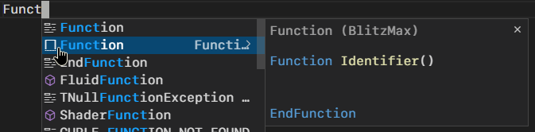
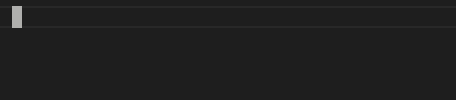
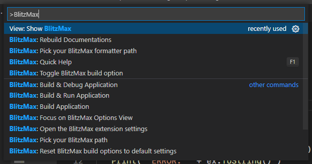
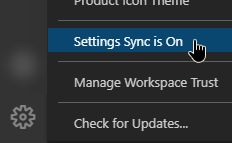
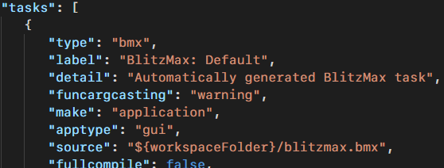
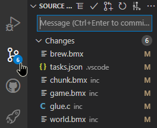
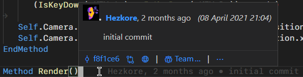
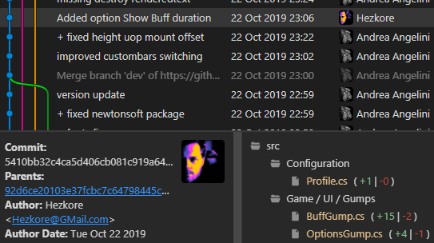

## Project settings
---
While each folder project has its own build options and launch configurations, it can also have its very own user settings!\
Right click the explorer view and select "Open Folder Settings".

It is also recommended that you have a quick glance at the VS Code settings.\
There are a lot of cool features to enable, or disable!

## Using snippets
---
Most of the basic keywords like `Type`, `Function` and `For` have pre-made snippets.\
Look for the snippet icon when inserting known keywords.

## Command palette
---
Most of the options, buttons and features in VS Code are just commands.\
You can search and trigger these yourself by using the Command Palette _(Ctrl + Shift + P)_.\
It's perfect for when you're looking for something.

Try searching for `BlitzMax` to see all the BlitzMax commands.

Every command is bindable to any key.\
Read more about the Command Palette [here](https://code.visualstudio.com/docs/getstarted/userinterface#_command-palette).

## Syncing your settings
---
Use "Settings Sync" to use your VS Code settings on any computer.

Read more about Setting Sync [here](https://code.visualstudio.com/docs/editor/settings-sync).

## Learning about tasks
---
You don't have to manually edit your build task options in `tasks.json` thanks to the BlitzMax build options view.\
But it still a good idea to learn how tasks function by editing `tasks.json`, located in the `.vscode` folder in your project.

A task doesn't just have to compile your application, it can also start external applications, run scripts, test your application or generally anything you want.\
You can also create tasks that run in parallel, allowing you to compile multiple things at once.

Tasks are a powerful tool!

You can read the official documentations [here](https://code.visualstudio.com/docs/editor/tasks).\
Or read more in the "Building & Tasks" step.

## Compiling for other platforms & remotely
---
VS Code has a few methods for allowing you to compile for other platforms.

If you have access to multiple computers, you can simply use SSH to remotely develop your application.\
It allows you to code, compile and run your code remotely using the SSH protocol.\
You can read more about it [here](https://code.visualstudio.com/docs/remote/ssh).

If you're using Windows, you can use Windows WSL to compile for Linux.\
You can read more about it [here](https://code.visualstudio.com/docs/remote/wsl).

The BlitzMax VS Code extension supports all current remote development methods.\
A general overview of remote coding can be found [here](https://code.visualstudio.com/docs/remote/remote-overview).

## Git integration
---
The BlitzMax VS Code extension fully supports the built-in Git extension.

## Extensions
---
Half of VS Code's power comes from extensions.\
You can read more about extensions [here](https://code.visualstudio.com/docs/editor/extension-marketplace).

[Luna Paint](https://marketplace.visualstudio.com/items?itemName=Tyriar.luna-paint) lets you open any image and start editing like any other file.

The [GitLens](https://marketplace.visualstudio.com/items?itemName=eamodio.gitlens) extension expands your Git experience by adding more features and options.

[Git Graph](https://marketplace.visualstudio.com/items?itemName=mhutchie.git-graph) helps you visualize your Git branches.

